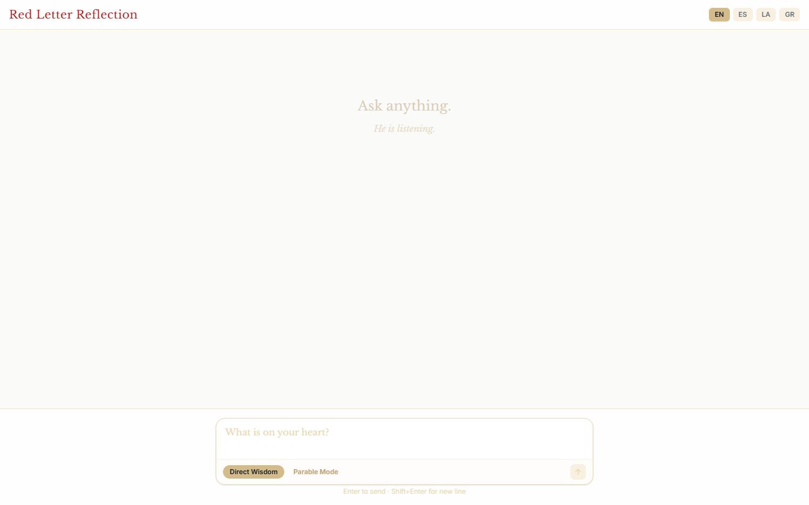
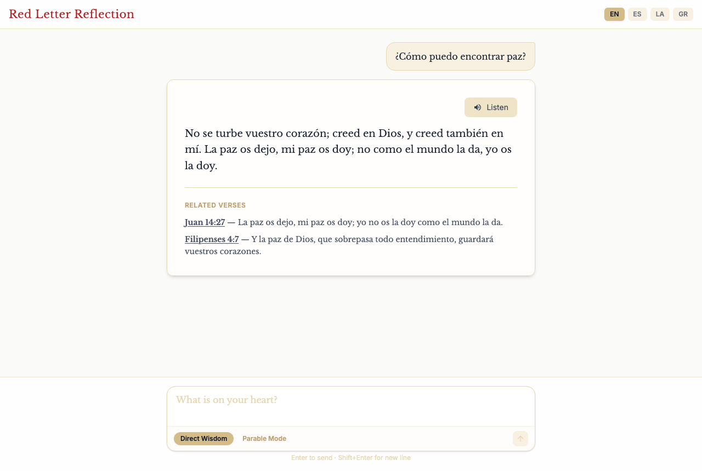

# JesusGPT — Red Letter Reflection

<p>   </p>

An AI Bible-study chat where the model answers in the first-person voice of Jesus, grounded in the Gospels. Ask a question, get an answer rooted in relevant verses — either a direct response or an original parable — in English, Spanish, Latin, or Greek.

## The hard part

The hard part was keeping the model from just making things up. The Gospels are the only source, so every answer goes through a retrieval step: keyword and theme matching over `server/data/gospels.json` pulls the relevant verses, and only those verses are handed to the model (Gemini primary, Groq `llama-3.3-70b-versatile` as a fallback). That grounding is what lets it speak as Jesus without hallucinating doctrine. It's also multilingual across English, Spanish, Latin and Greek, with the dataset rebuilt from the web by `npm run extract` — so retrieval has to work in four languages from one source set.

The result: ask a question, get an answer that cites the verses it's based on, or an original parable in the same register.

## Architecture

```
api/index.js    Vercel serverless entry: Express app mounting /api/reflect and /api/health
                (loads server/data/gospels.json; /api/health reports which API keys are set)
server/         Full Express server for local dev (port 3001)
  routes/       reflect.js (question → verses → reflection), speech.js (TTS placeholder —
                client uses the Web Speech API)
  services/     bibleLoader.js, ragEngine.js (keyword/theme retrieval over the Gospels),
                geminiClient.js (Gemini primary, Groq llama-3.3-70b-versatile fallback),
                ttsService.js (placeholder)
  data/         gospels.json (multilingual Gospel dataset; rebuild with `npm run extract`)
  scripts/      extractGospels.js (downloads/builds the Gospel data)
client/         Vite + React 19 + Tailwind 4 SPA (port 3000, proxies /api → localhost:3001).
                Has its own README; this file covers the whole repo.
```

## Reflect API

`POST /api/reflect` with:

```json
{ "question": "…", "language": "en|es|la|gr", "mode": "direct|parable", "history": [{"role":"user","content":"…"}] }
```

Returns `{ response, verses: [{ reference, text }] }`. The RAG layer finds the most relevant Gospel verses; the model speaks in the first person without breaking voice (max 120 words direct, 250 for parables).

## Getting Started (local dev)

```bash
npm install                     # root: express, cors, gemini/groq SDKs + client deps via scripts
cp server/.env.example server/.env   # set GROQ_API_KEY and GEMINI_API_KEY
npm run extract                 # build server/data/gospels.json (required before first run)
npm run dev                     # runs server (3001) + client (3000) concurrently
```

Individual scripts: `npm run dev:server`, `npm run dev:client`, `npm run build` (installs + builds the client), `npm run extract`.

## Environment Variables

| Variable | Where | Required | Purpose |
|---|---|---|---|
| `GEMINI_API_KEY` | root `.env.example`, `server/.env.example` | Yes | Primary reflection generation |
| `GROQ_API_KEY` | `server/.env.example` | No | Fallback provider (`llama-3.3-70b-versatile`) |
| `PLAYHT_API_KEY`, `PLAYHT_USER_ID` | `server/.env.example` | No | Reserved for future server-side TTS |
| `PORT` | both | No | Server port, default 3001 |

## Deploy to Vercel

`vercel.json` handles everything: `npm run build` compiles the client (`outputDirectory: client/dist`), `/api/*` rewrites to `api/index.js`, and the function is configured with `maxDuration: 30` and `includeFiles: server/data/**` so the Gospel dataset is bundled. Set `GEMINI_API_KEY` (and optionally `GROQ_API_KEY`) in the Vercel project's environment variables.

## Status

v1.0.0 — working. UI default language is English with in-app language switching.
## Screenshots




